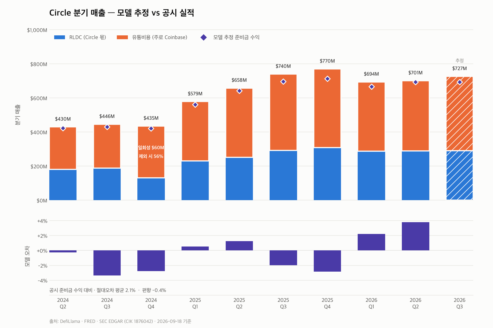
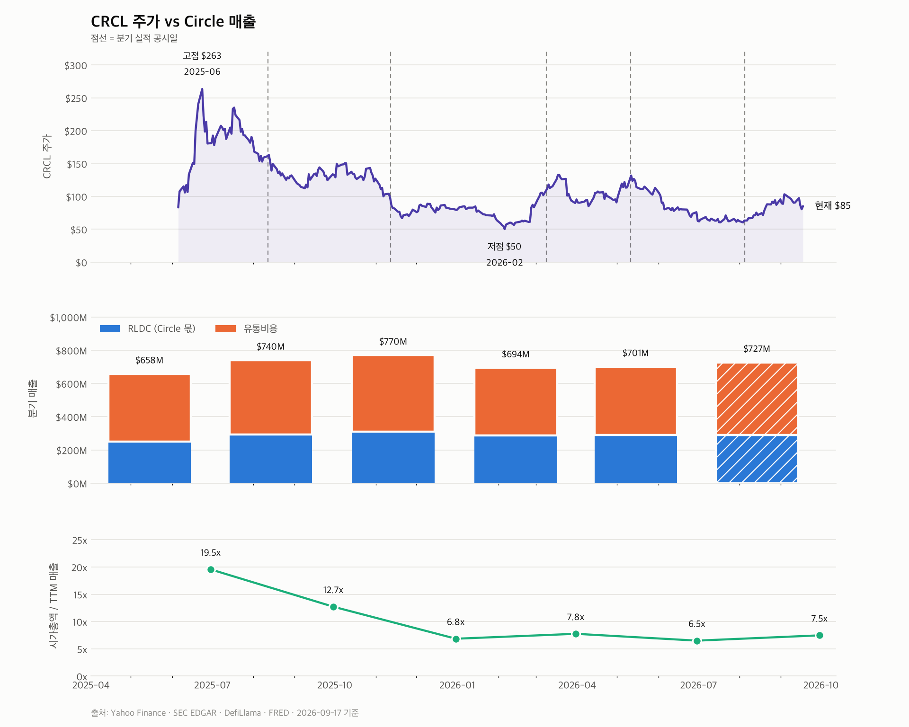
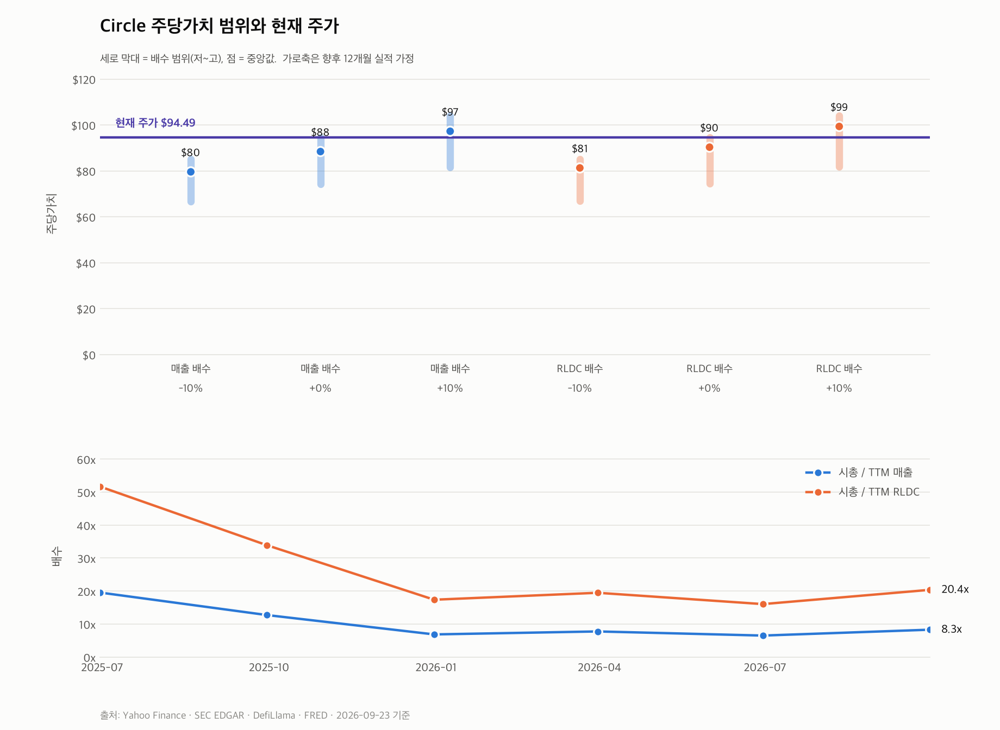
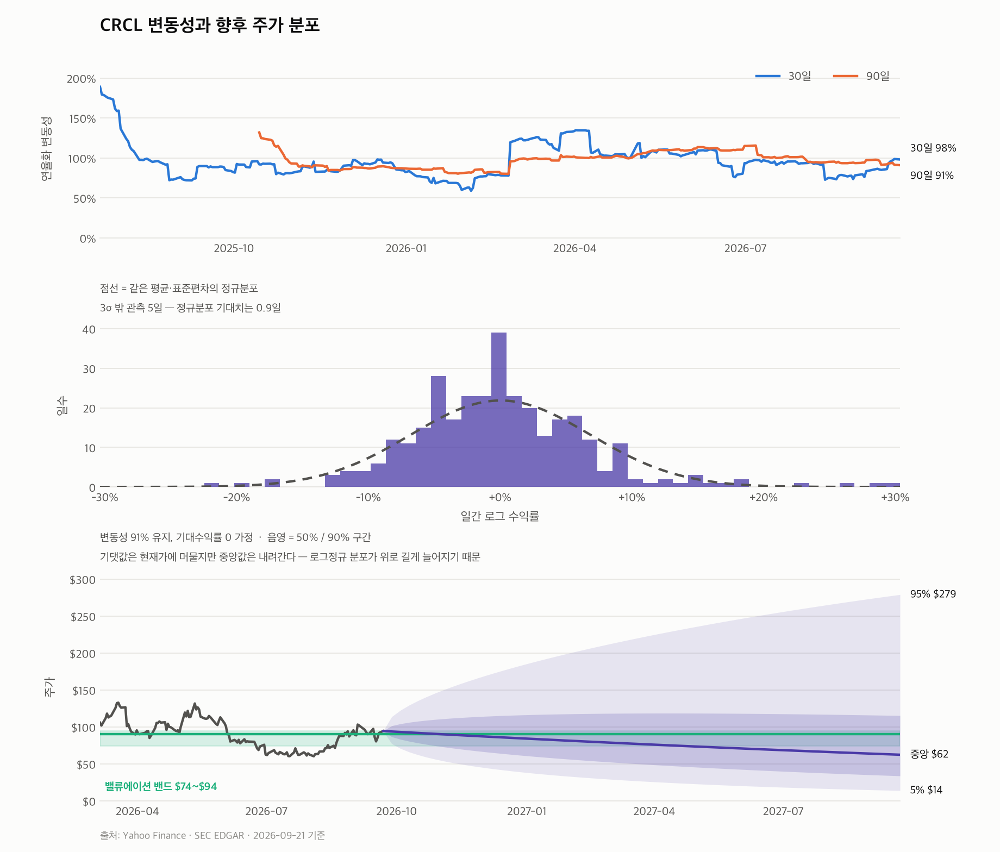
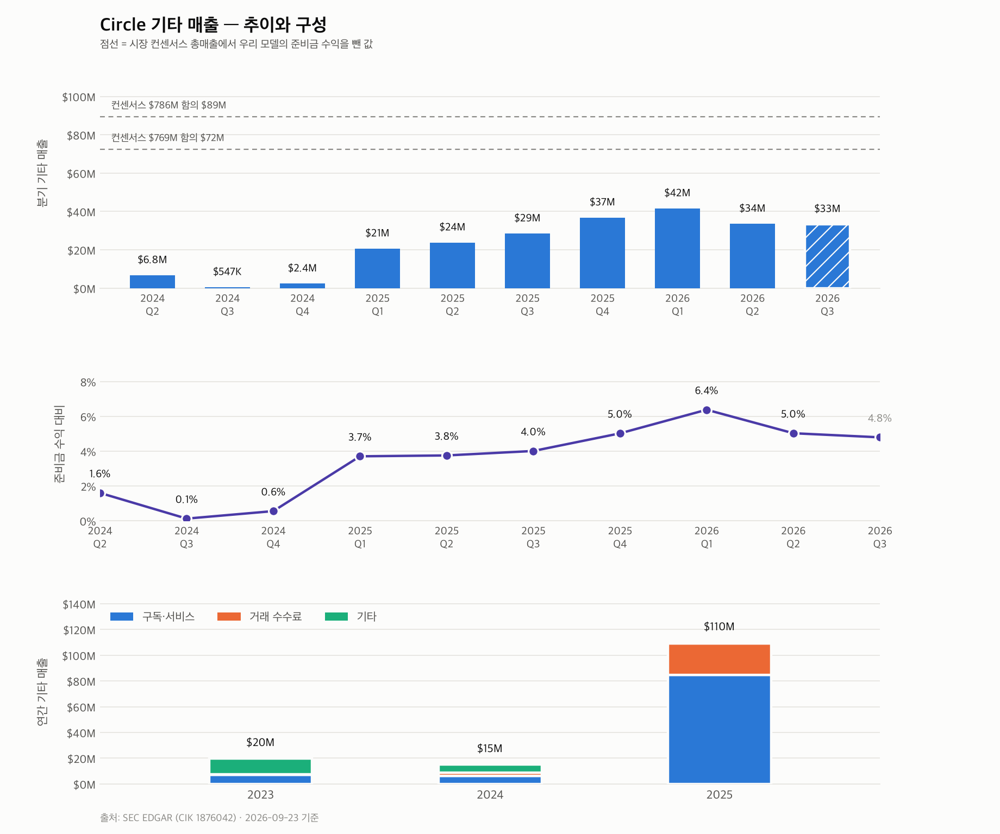
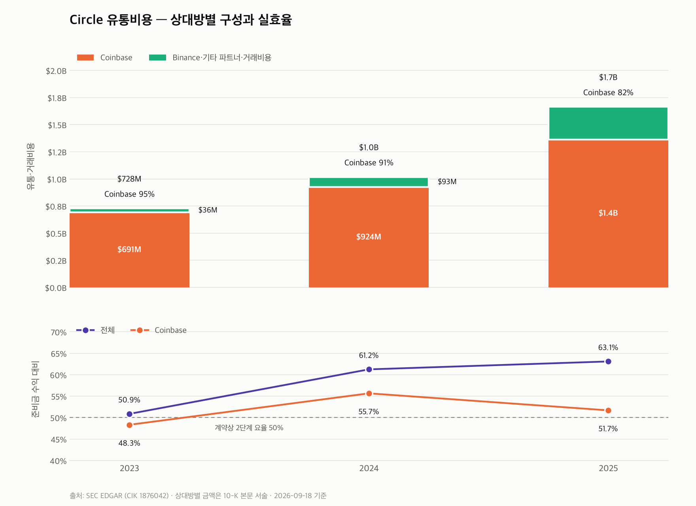
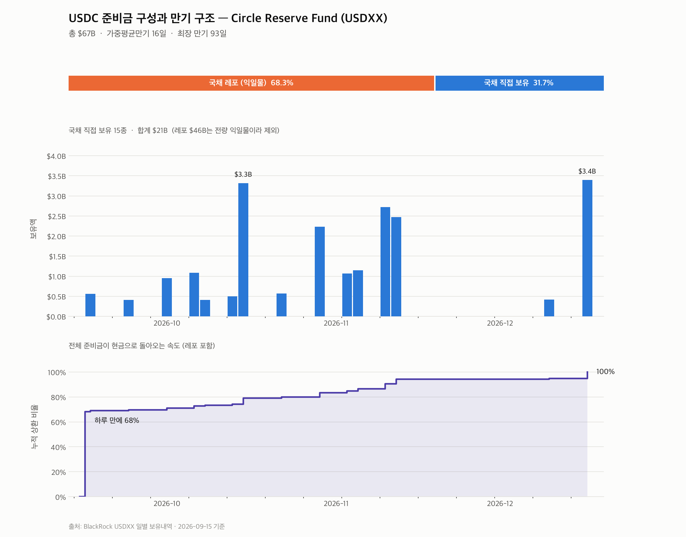
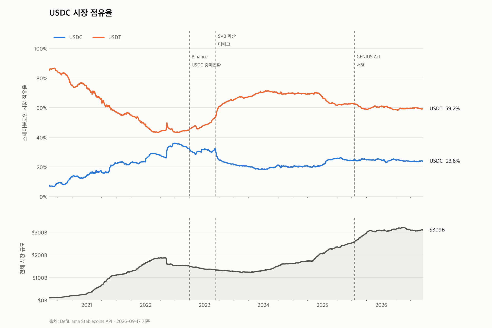

# Circle Revenue Structure

Circle(USDC 발행사)의 수익 구조를 데이터로 뜯어보는 프로젝트.

Circle의 매출은 사실상 **준비금 운용수익 = 단기금리 x 발행잔액** 으로 결정된다.
준비금은 만기 93일 이내의 미 국채와 익일물 국채 레포로만 구성돼 듀레이션이
사실상 0이라, 금리가 바뀌면 가격이 아니라 이자수익이 움직인다.
그래서 이 저장소는 두 축을 추적한다.

- **발행잔액 (AUM)** — 발행량 추이, 시장 점유율
- **준비금과 단기금리** — 만기 구조, 기준금리 관계

## 발행량 차트


USDC 단독으로 보면 2023년 3월 SVB 파산 당시의 급락($43B -> $32B)이 선명하다.


## 기준금리 오버레이

발행잔액과 미 연방기금 실효금리를 같은 시간축에 놓고, 금리 인상기/인하기를
배경 띠로 깐다. 단위가 다른 두 지표를 이중축(y축 2개)으로 겹치면 교차점이
눈금 선택에 따라 임의로 바뀌므로, 축을 나눠 쌓고 시간축만 공유시킨다.

```bash
./.venv/bin/python rate_overlay.py
```


### 대조군을 꼭 같이 볼 것

위 차트만 보면 "인상기에 USDC가 반토막 났다"는 인과가 성립하는 것처럼 보인다.
그런데 같은 금리 환경에 놓인 USDT를 대조군으로 붙이면 해석이 무너진다.
USDT는 같은 인상기 구간을 **증가하며** 통과했다.

```bash
./.venv/bin/python rate_overlay.py --placebo
```


2022–23년 USDC 감소의 실제 원인은 금리가 아니라 USDC 고유의 사건들이다.

| 시점 | 낙폭 | 원인 |
|---|---|---|
| 2023-03 | -22.5% | SVB 파산, Circle 준비금 $3.3B 묶임 -> 디페그 |
| 2022-10 | -10.2% | Binance의 USDC 강제 BUSD 전환 |

반대로 2025년 급증도 인하 때문이 아니라 GENIUS Act, MiCA 등 규제 지형 변화가
주된 동인이다. 금리 채널은 이론적으로 존재하지만 1차 요인이 아니다.

### 레짐 판정

FOMC 발표일을 하드코딩하지 않는다. 각 날짜를 중심으로 앞뒤 45일의 금리 변화가
0.15%p를 넘으면 방향성 있는 레짐으로 보고, 60일 미만 구간은 버린다.
데이터가 갱신되면 구간도 따라 움직인다.

## 매출 추정 모델

```bash
./.venv/bin/python revenue_model.py --scenario
```



```
준비금 수익 = 분기 평균 USDC 발행잔액 x 단기금리 x 기간
유통비용    = 매출 x 비율        (과거는 공시 실제값, 진행 분기는 최근 평균 가정)
RLDC        = 매출 - 유통비용    (Circle이 실제로 갖는 몫)
```

9개 분기를 공시와 대조한 결과 **절대오차 평균 2.1%, 편향 −0.4%** 로 사실상
무편향이다.

처음에는 총매출과 대조해 절대오차 3.6%에 편향이 −3.6%로 일관되게 과소 추정했다.
모델이 추정하는 건 준비금 수익인데 총매출과 비교했기 때문이다. 총매출에는
기타 매출(구독·거래 수수료)이 섞여 있고, 그 비중이 2024년 0.9%에서 2026년
5%대로 커지는 중이라 편향도 함께 커지고 있었다. 대조 대상을 공시 준비금 수익
항목(`us-gaap:InterestAndDividendIncomeOperating`)으로 바꾸자 편향이 사라졌다.

같은 이유로 **유통비용 비율의 분모도 준비금 수익**이다. Coinbase 계약이 걸리는
대상이 준비금 수익이고, 기타 매출은 나누지 않는 돈이다.

### 유통비용은 왜 모델링하지 않는가

계약이 2단계라서 그렇다 (FY2025 10-K).

> Under the Collaboration Agreement, Coinbase receives allocations based on the
> amount of USDC held **on its platform** after our issuer retention, and
> Coinbase **also** receives **half of the remaining amount** tied to broader
> ecosystem growth after amounts paid to any approved third-party ecosystem
> participants.

1단계를 결정하는 변수가 "Coinbase 플랫폼 내 USDC 잔액"인데, 이건 체인에
찍히지 않고 Circle 공시에만 나온다. 온체인 데이터로는 원리적으로 추정이
불가능하다.

대신 비율이 안정적이다 (준비금 수익 대비 최근 6분기 61.8~64.2%). 그래서 과거
분기는 공시에서 읽어오고, 진행 중 분기만 직전 4분기 평균을 쓴다. 복원 분기와
일회성이 낀 분기는 그 평균 기준에서 뺀다.

상대방별 구성은 `distribution_costs.py` 참조.

### 일회성 항목 주의

2024Q4 유통비중이 70.0%로 다른 분기(57~62%)보다 8%p 넘게 튄다. 원인은
Circle FY2025 10-K에 있다.

> In November 2024, we entered into an agreement (the "November Binance
> Agreement") with Binance... we paid Binance a **$60.3 million one-time
> upfront fee** and agreed to pay monthly incentive fees based on USDC
> balances held on Binance's platform and in its treasury.

이 선급금을 빼면 56.1%로 인접 분기 수준이다. 참고로 FY2024 유통비용
$1,017.4M 중 Coinbase가 $924.5M(90.9%)이고, 나머지 $92.9M의 대부분이 이
Binance 건이다.

`ONE_OFF_COSTS`에 등록해두어 표와 차트에 함께 표시되며, 진행 분기의 비율
가정 기준에서는 제외한다.

### 분기 복원

10-K는 4분기를 따로 태깅하지 않고 연간만 싣는다. 이때는 `연간 - 9개월 누적`
으로 복원한다. 복원한 분기는 출력에 표시되며, 일회성 지급이 섞일 수 있어
진행 분기의 비율 가정 기준에서는 제외한다.

### 시나리오

`--scenario`는 금리와 발행잔액을 흔들었을 때의 연간 매출과 Circle 몫을 낸다.

```
금리 +25bp 단독 효과: 준비금 수익 +183M  ->  Circle 몫 +77M
                     (차액 106M은 유통비용으로 유출)
```

금리 인상 효과의 약 60%가 Coinbase로 가고 Circle에는 40%만 남는다는 뜻이다.

## 주가 vs 매출

```bash
./.venv/bin/python price_vs_revenue.py
```



CRCL은 2025년 6월 상장 후 3주 만에 $263까지 갔다가 2026년 2월 $50까지 빠졌다.
고점 대비 −68%. 그런데 같은 기간 매출은 계속 늘었다.

| | 2025Q2 | 2026Q3 | 변화 |
|---|---|---|---|
| TTM 매출 | $2.1B | $2.9B | **+37%** |
| 시가총액 | $41B | $22B | **−48%** |
| 시총/TTM 매출 | 19.5x | 7.5x | **−62%** |

**주가 하락은 실적 악화가 아니라 밸류에이션 조정이다.** 배수가 19.5배에서
7.5배로 내려앉았고, 2026Q1 이후로는 6.5~7.8배 사이에서 안정돼 있다.

다만 매출 증가율 자체는 둔화 중이다 — 전년비 +77%(2025Q4) → +20%(2026Q1)
→ +7%(2026Q2) → −2%(2026Q3 추정). 금리 인하가 준비금 수익률을 깎았기 때문이고,
이번 인상 사이클이 여기에 어떻게 작용할지가 `revenue_model.py --scenario`의
질문이다.

### 시가총액 계산 주의

시점 주식수(각 공시 표지의 발행주식수, 클래스 합산)를 쓴다. 가중평균
희석주식수를 쓰면 상장 분기에 상장 전 기간이 섞여 실제의 절반 이하로 나온다
(2025Q2: 가중평균 107.5M vs 표지 229.4M).

## 주당가치 범위

```bash
./.venv/bin/python valuation.py
```



모델은 준비금 수익과 RLDC까지는 시장 데이터로 계산한다. 거기서 주당가치로
넘어가려면 **배수라는 가정이 하나 더 필요하고, 그건 데이터가 정해주지 않는다.**
그래서 단일 적정주가 대신 범위를 내고, 현재 주가가 함의하는 배수를 나란히 둔다.

배수 범위는 재평가가 끝난 2025Q4 이후 4개 분기에서 뽑는다. 상장 직후의
19.5x(매출) / 51.7x(RLDC)는 수급이 만든 값이라 기준으로 쓰기 어렵다.

| 실적 가정 | 매출 배수 기준 | RLDC 배수 기준 |
|---|---|---|
| −10% | $67 ~ $85 (중 $80) | $67 ~ $85 (중 $81) |
| 0% | $74 ~ $94 (중 $88) | $74 ~ $94 (중 $90) |
| +10% | $82 ~ $104 (중 $97) | $82 ~ $104 (중 $99) |

두 기준이 거의 같은 답을 주는 건 우연이 아니다. RLDC 마진이 38~41%로 안정적
이라 매출 배수와 RLDC 배수가 같은 시가총액을 서로 다르게 표현한 것에 가깝다.

### 왜 이익 배수를 쓰지 않는가

FY2025 영업손익은 **−$96.4M**이지만 주식보상이 **$566.2M**이다 (전년 $50.1M).
상장에 따른 일시적 팽창이라 정상화 가정이 결과를 지배한다. 주식보상을 빼면
조정 영업이익은 +$470M이 된다 — 어느 쪽을 쓰느냐로 답이 뒤집히는 수준이라,
배수는 매출과 RLDC에만 건다.

## 변동성과 향후 주가 분포

```bash
./.venv/bin/python volatility.py
```



적정주가 범위를 내더라도 주가가 거기 머문다는 보장은 없다. 얼마나 벗어날 수
있는지를 같은 단위로 보여주는 것이 변동성이다.

| 구간 | 연율화 변동성 |
|---|---|
| 30일 | 98.1% |
| 90일 | 91.0% |
| 상장 이후 | 107.8% |

최대낙폭 −80.9%. 일간 수익률의 3σ 밖 관측이 5일로, 정규분포 기대치(0.9일)의
5배가 넘는다 — 꼬리가 두껍다.

변동성 91%가 유지된다고 보면 향후 분포는 이렇다 (기대수익률 0 가정).

| 기간 | 5% | 25% | 중앙 | 75% | 95% |
|---|---|---|---|---|---|
| 1개월 | $59 | $76 | $91 | $109 | $141 |
| 3개월 | $40 | $63 | $85 | $116 | $180 |
| 12개월 | $14 | $34 | $62 | $115 | $279 |

**밸류에이션 밴드는 $74~$94로 폭이 27%인데, 12개월 90% 구간은 $14~$279다.**
변동성이 밸류에이션 범위보다 70배 넓다. 밸류에이션이 무의미하다는 뜻은 아니고,
이 종목에서 주가를 움직이는 것은 적정가치 추정의 정밀도가 아니라는 뜻이다.

중앙값이 현재가보다 아래로 내려가는 건 로그정규 분포의 성질이다. 기댓값은
현재가에 머물지만 분포가 위로 길게 늘어져서 중앙값은 내려간다.

## 기타 매출

```bash
./.venv/bin/python other_revenue.py
```



준비금 수익 외의 매출. 전체의 5% 안팎으로 작지만 성격이 다르다 — 금리와
무관하고, 준비금 수익과 달리 **Coinbase와 나누지 않는다**. 커질수록 Circle이
실제로 갖는 몫의 비중이 올라간다.

연간 구성을 보면 2025년에 성격이 바뀌었다.

| 연도 | 구독·서비스 | 거래 수수료 | 기타 | 합계 |
|---|---|---|---|---|
| 2023 | $7.0M | $0.5M | $12.3M | $19.9M |
| 2024 | $6.1M | $2.9M | $6.3M | $15.2M |
| 2025 | **$84.8M** | $24.3M | $0.7M | **$109.8M** |

구독·서비스가 $6M에서 $85M으로 뛰면서 레거시 "기타"를 대체했다.

### 모델의 약한 고리

`revenue_model.py`가 과거 비율에 의존하는 유일한 부분이 여기다. 준비금 수익은
잔액과 금리로 계산되지만 기타 매출은 그럴 수 없어서 직전 4분기의 준비금 수익
대비 비율(약 5%)을 끌고 간다. 남은 모델 오차는 대부분 여기서 나온다.

`--consensus`로 시장 컨센서스 총매출을 넣으면, 거기서 우리 모델의 준비금
수익을 뺀 값을 점선으로 그린다. 컨센서스가 기타 매출에 대해 무엇을 가정하는지
바로 보인다.

## 유통비용 상대방별 구성

```bash
./.venv/bin/python distribution_costs.py
```



| 연도 | 준비금수익 | 유통·거래비용 | Coinbase | 기타 | CB/준비금 | 전체/준비금 |
|---|---|---|---|---|---|---|
| 2023 | $1.4B | $728M | $691M | $36M | 48.3% | 50.9% |
| 2024 | $1.7B | $1.0B | $924M | $93M | 55.7% | 61.2% |
| 2025 | $2.6B | $1.7B | $1.4B* | $301M | 51.7% | 63.1% |

\* FY2025 Coinbase 금액은 본문이 $1.4B로 반올림돼 있어 증가분($438.4M)에서 역산.

**"Coinbase가 50% 가져간다"는 2단계 요율만 가리킨다.** 1단계(플랫폼 내 잔액)가
따로 있어 실효율은 50%를 넘는다 — 2024년 55.7%.

반대로 2025년에 51.7%로 내려간 건 2단계 조항 때문이다. "다른 파트너 지급분을
**뺀** 나머지의 절반"이라, Binance 같은 파트너가 늘수록 Coinbase 몫이 깎인다.
유통비용 중 Coinbase 비중이 2023년 95% → 2025년 82%로 희석됐다.

단, **전체** 비율은 50.9% → 63.1%로 올랐다. Coinbase 몫이 줄어든 것보다 새
파트너에 나가는 돈이 더 빨리 늘었다는 뜻이다.

상대방별 금액은 XBRL에 태깅돼 있지 않고 10-K 본문 서술에만 나오므로,
`DISCLOSED`에 출처와 함께 적어두고 총액·준비금 수익만 API에서 받는다.

## 준비금 구성과 만기 구조

Circle 매출은 준비금 운용수익이고, 그 수익이 금리를 얼마나 빨리 따라가는지는
만기 구조가 결정한다. BlackRock이 매일 공시하는 USDXX 보유내역을 받아 그린다.

```bash
./.venv/bin/python reserves.py
```



- **익일물 국채 레포 68.3%** — 하루 만에 전액 상환되고 새 금리로 재체결된다
- **국채 직접 보유 31.7%** — 만기 93일 이내로 사다리를 짠다
- 가중평균만기 **16일**. 금리가 100bp 움직여도 평가손익은 0.045%에 불과하지만,
  이자수익은 두 달이면 거의 전량이 새 금리로 갈아탄다

레포 하나가 68%라 국채 사다리와 같은 축에 놓으면 사다리가 뭉개진다.
그래서 구성비, 국채 만기 분포, 전체 상환 속도를 각각 다른 패널로 나눴다.

## 시장 점유율

절대 발행잔액만 보면 시장이 커져서 늘어난 것인지 경쟁에서 이겨서 늘어난
것인지 구분되지 않는다. 점유율이 그 둘을 분리한다.

```bash
./.venv/bin/python market_share.py
```



USDC 점유율이 꺾인 지점들이 금리 변곡점이 아니라 개별 사건과 겹친다는 점이
차트에서 바로 보인다. 2022년 9월 Binance 강제전환, 2023년 3월 SVB 파산이
각각 하락 구간의 시작점이고, 2025년 GENIUS Act 이후 회복한다.

## 준비

```bash
python3 -m venv .venv
./.venv/bin/pip install matplotlib requests
```

## 실행

```bash
./.venv/bin/python circle_supply.py
```

`output/circle_supply.png` 생성. x축 시간, y축 유통량(USD 환산).

### 옵션

### circle_supply.py

| 옵션 | 설명 | 기본값 |
|---|---|---|
| `--coins` | `usdc`, `eurc`, `usyc` 중 쉼표 구분 | 전체 |
| `--start` / `--end` | 기간 (`YYYY-MM-DD`) | 전체 |
| `--layout` | `facet`(코인별 분할) / `overlay`(한 축) / `auto` | `auto` |
| `--scale` | `linear` / `log` — overlay에만 적용 | `linear` |
| `--refresh` | 캐시 무시하고 API 재호출 | 꺼짐 |
| `--out` | 저장 경로 | `output/circle_supply.png` |

```bash
# USDC만, 2021년 이후
./.venv/bin/python circle_supply.py --coins usdc --start 2021-06-01

# 세 코인을 한 축에 로그로 겹쳐보기
./.venv/bin/python circle_supply.py --layout overlay --scale log
```

### rate_overlay.py

| 옵션 | 설명 | 기본값 |
|---|---|---|
| `--coins` | 대상 코인 | `usdc` |
| `--start` / `--end` | 기간 | 전체 |
| `--placebo` | USDT 대조군 패널 추가 | 꺼짐 |
| `--no-bands` | 레짐 배경 띠 끄기 | 꺼짐 |
| `--refresh` | 캐시 무시 | 꺼짐 |

### revenue_model.py

| 옵션 | 설명 | 기본값 |
|---|---|---|
| `--rate-series` | FRED 금리 시계열 | `DTB3` (3개월 국채) |
| `--scenario` | 금리/잔액 시나리오 표 출력 | 꺼짐 |
| `--calibration` | 실현 준비금 수익률과 대리변수의 정합성 점검 | 꺼짐 |
| `--refresh` | 캐시 무시 | 꺼짐 |

`--calibration`은 공시된 준비금 수익을 평균 잔액으로 역산해 실현 수익률을 구하고
대리변수(단기금리)와 비교한다. 최근 4분기 배수 0.998 — 대리변수를 그대로 써도
되는 수준이다.

### reserves.py / market_share.py

| 옵션 | 설명 |
|---|---|
| `--refresh` | 캐시 무시하고 재수집 |
| `--out` | 저장 경로 |
| `--start` / `--end` | 기간 (market_share.py) |
| `--no-events` | 사건 표시선 끄기 (market_share.py) |

`market_share.py`는 시장 규모가 $10B에 도달하기 전 구간을 기본으로 잘라낸다.
초창기에는 점유율이 소수 지갑에 좌우돼 의미가 없기 때문이다.

`--layout auto`는 시리즈 간 규모 차이가 5배를 넘으면 자동으로 축을 나눈다.
USDC($74B)와 EURC($473M)를 한 축에 놓으면 작은 쪽이 바닥에 깔리고,
로그로 피하면 USDC의 실제 등락(2023년 SVB 급락 등)이 뭉개지기 때문이다.

## 대상 코인

| 키 | 코인 | 성격 | 현재 유통량 |
|---|---|---|---|
| `usdc` | USDC | USD 페그 스테이블코인 | ~$74B |
| `eurc` | EURC | EUR 페그 스테이블코인 | ~$473M |
| `usyc` | USYC | 토큰화 국채 MMF (Hashnote 인수) | ~$2.6B |

EURC는 유로 페그라 원화 단위가 다르므로, 비교 가능하도록 API의 USD 환산값을 쓴다.

## 데이터

| 지표 | 출처 | 인증 |
|---|---|---|
| 발행잔액 · 시장 규모 | [DefiLlama Stablecoins API](https://defillama.com/stablecoins) | 불필요 |
| 기준금리 | [FRED DFF](https://fred.stlouisfed.org/series/DFF) (연방기금 실효금리, 일별) | 불필요 |
| 준비금 보유내역 | [BlackRock USDXX](https://www.blackrock.com/cash/en-us/products/329365/circle-reserve-fund) (일별 공시) | 불필요 |
| 공시 실적 | [SEC EDGAR](https://www.sec.gov/cgi-bin/browse-edgar?action=getcompany&CIK=0001876042) (CIK 1876042) | 불필요* |
| 주가 | Yahoo Finance (CRCL) | 불필요 |

\* SEC는 요청마다 연락처가 담긴 User-Agent를 요구한다. 본인 것으로 설정할 것:

```bash
export SEC_USER_AGENT="이름 you@example.com"
```

총매출(`us-gaap:Revenues`)과 준비금 수익
(`us-gaap:InterestAndDividendIncomeOperating`)은 companyfacts API의 표준
태그로 바로 받는다. 유통비용은 회사 확장 태그
(`crcl:DistributionTransactionAndOtherCosts`)라 각 10-Q/10-K의 XBRL 인스턴스를
직접 받아 파싱한다. 상대방별 금액은 아예 태깅돼 있지 않고 본문 서술에만 있다.

응답은 `data/`에 캐시하며 12시간 지나면 자동 갱신한다.

## 구조

| 파일 | 역할 |
|---|---|
| `circle_data.py` | 데이터 수집, 캐시, 차트 스타일 공용 모듈 |
| `circle_supply.py` | 발행량 차트 |
| `rate_overlay.py` | 발행잔액 vs 기준금리 차트 |
| `reserves.py` | 준비금 구성·만기 구조 차트 |
| `market_share.py` | 시장 점유율 차트 |
| `revenue_model.py` | 매출 추정 모델 + 공시 검증 + 시나리오 |
| `distribution_costs.py` | 유통비용 상대방별 구성과 실효율 |
| `price_vs_revenue.py` | 주가·시가총액 배수 vs 매출 |
| `other_revenue.py` | 기타 매출 추이와 구성 |
| `valuation.py` | 배수 기반 주당가치 범위 |
| `volatility.py` | 실현 변동성과 향후 주가 분포 |

## 로드맵

- [x] 발행 코인 유통량 시계열 차트
- [x] 기준금리 오버레이 — 금리와 발행잔액의 관계 검증 (대조군 포함)
- [x] 준비금 구성 (BlackRock USDXX 보유 국채, 만기 사다리)
- [x] USDT 대비 점유율 추이
- [x] 준비금 운용수익 추정 모델 (공시 검증 + 시나리오)
- [x] 유통비용 상대방별 분해
- [x] 주가 vs 매출 비교
- [x] 배수 기반 주당가치 범위
- [x] 변동성과 향후 주가 분포

## 주의

공개 데이터로 만든 분석 도구다. 투자 판단이나 권유가 아니다.
주당가치는 배수 가정에 전적으로 의존하고, 향후 주가 분포는 예측이 아니라
"현재 변동성이 유지되면 이 정도 폭"이라는 조건부 서술이다.
