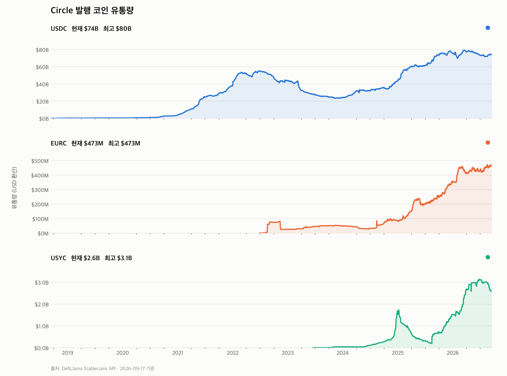
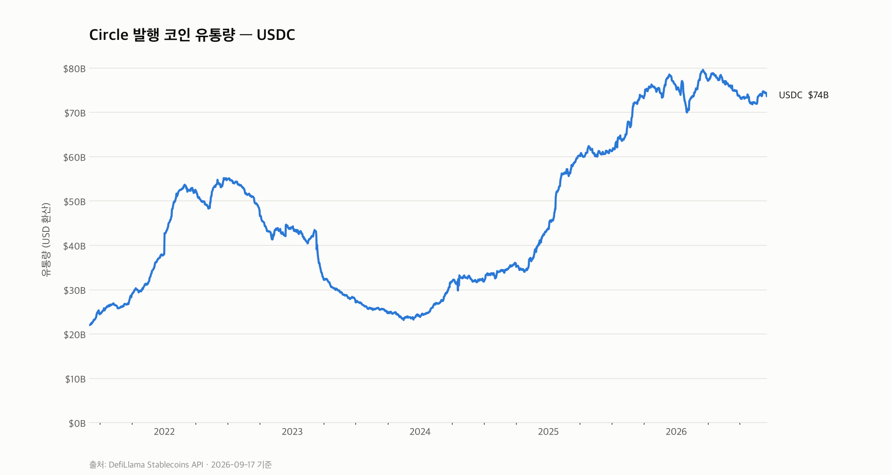
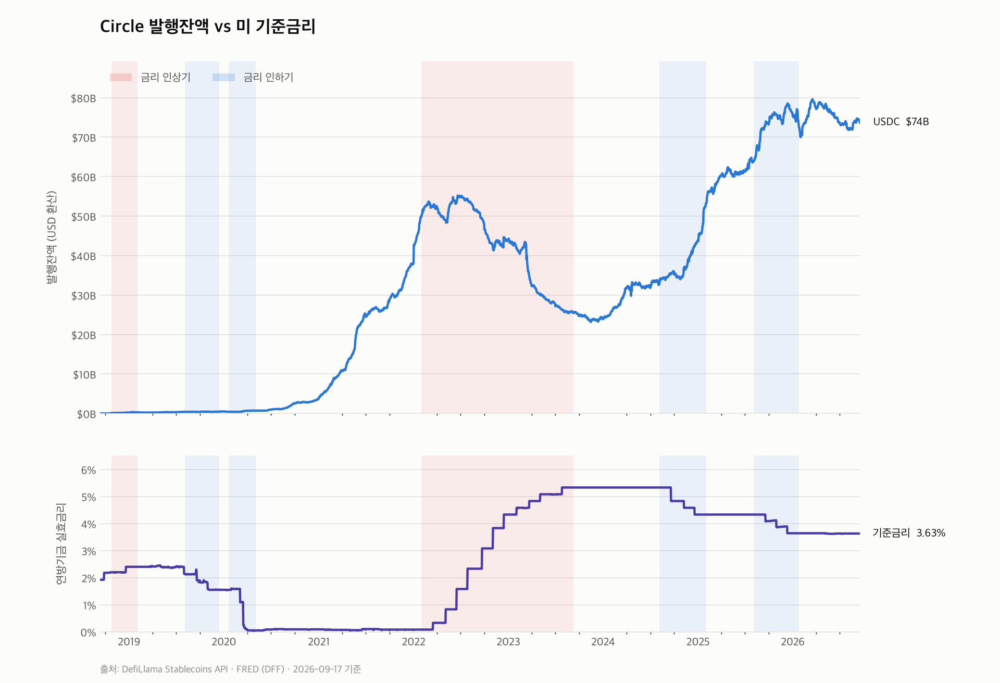
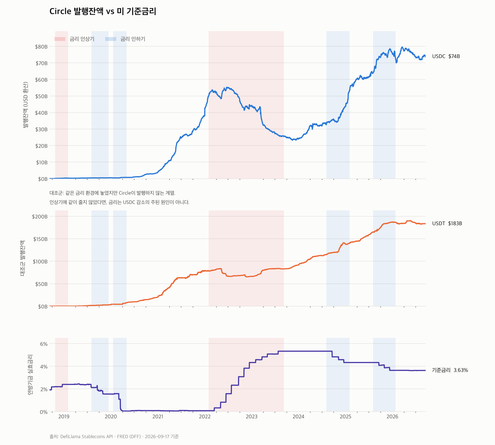

# Circle Revenue Structure

Circle(USDC 발행사)의 수익 구조를 데이터로 뜯어보는 프로젝트.

Circle의 매출은 사실상 **준비금 운용수익 = 단기금리 x 발행잔액** 으로 결정된다.
준비금은 만기 93일 이내의 미 국채와 익일물 국채 레포로만 구성돼 듀레이션이
사실상 0이라, 금리가 바뀌면 가격이 아니라 이자수익이 움직인다.
그래서 이 저장소는 두 축을 추적한다.

- **발행잔액 (AUM)** — 현재 구현됨
- **준비금 구성과 단기금리** — 예정

## 발행량 차트



USDC 단독으로 보면 2023년 3월 SVB 파산 당시의 급락($43B -> $32B)이 선명하다.



## 기준금리 오버레이

발행잔액과 미 연방기금 실효금리를 같은 시간축에 놓고, 금리 인상기/인하기를
배경 띠로 깐다. 단위가 다른 두 지표를 이중축(y축 2개)으로 겹치면 교차점이
눈금 선택에 따라 임의로 바뀌므로, 축을 나눠 쌓고 시간축만 공유시킨다.

```bash
./.venv/bin/python rate_overlay.py
```



### 대조군을 꼭 같이 볼 것

위 차트만 보면 "인상기에 USDC가 반토막 났다"는 인과가 성립하는 것처럼 보인다.
그런데 같은 금리 환경에 놓인 USDT를 대조군으로 붙이면 해석이 무너진다.
USDT는 같은 인상기 구간을 **증가하며** 통과했다.

```bash
./.venv/bin/python rate_overlay.py --placebo
```



2022–23년 USDC 감소의 실제 원인은 금리가 아니라 USDC 고유의 사건들이다.

| 시점 | 낙폭 | 원인 |
|---|---|---|
| 2023-03 | -22.5% | SVB 파산, Circle 준비금 $3.3B 묶임 -> 디페그 |
| 2022-10 | -10.2% | Binance의 USDC 강제 BUSD 전환 |

반대로 2025년 급증도 인하 때문이 아니라 GENIUS Act, MiCA 등 규제 지형 변화가
주된 동인이다. 금리 채널은 이론적으로 존재하지만 1차 요인이 아니다.

### 레짐 판정

FOMC 발표일을 하드코딩하지 않는다. 각 날짜를 중심으로 앞뒤 45일의 금리 변화가
0.15%p를 넘으면 방향성 있는 레짐으로 보고, 60일 미만 구간은 버린다.
데이터가 갱신되면 구간도 따라 움직인다.

## 준비

```bash
python3 -m venv .venv
./.venv/bin/pip install matplotlib requests
```

## 실행

```bash
./.venv/bin/python circle_supply.py
```

`output/circle_supply.png` 생성. x축 시간, y축 유통량(USD 환산).

### 옵션

### circle_supply.py

| 옵션 | 설명 | 기본값 |
|---|---|---|
| `--coins` | `usdc`, `eurc`, `usyc` 중 쉼표 구분 | 전체 |
| `--start` / `--end` | 기간 (`YYYY-MM-DD`) | 전체 |
| `--layout` | `facet`(코인별 분할) / `overlay`(한 축) / `auto` | `auto` |
| `--scale` | `linear` / `log` — overlay에만 적용 | `linear` |
| `--refresh` | 캐시 무시하고 API 재호출 | 꺼짐 |
| `--out` | 저장 경로 | `output/circle_supply.png` |

```bash
# USDC만, 2021년 이후
./.venv/bin/python circle_supply.py --coins usdc --start 2021-06-01

# 세 코인을 한 축에 로그로 겹쳐보기
./.venv/bin/python circle_supply.py --layout overlay --scale log
```

### rate_overlay.py

| 옵션 | 설명 | 기본값 |
|---|---|---|
| `--coins` | 대상 코인 | `usdc` |
| `--start` / `--end` | 기간 | 전체 |
| `--placebo` | USDT 대조군 패널 추가 | 꺼짐 |
| `--no-bands` | 레짐 배경 띠 끄기 | 꺼짐 |
| `--refresh` | 캐시 무시 | 꺼짐 |

`--layout auto`는 시리즈 간 규모 차이가 5배를 넘으면 자동으로 축을 나눈다.
USDC($74B)와 EURC($473M)를 한 축에 놓으면 작은 쪽이 바닥에 깔리고,
로그로 피하면 USDC의 실제 등락(2023년 SVB 급락 등)이 뭉개지기 때문이다.

## 대상 코인

| 키 | 코인 | 성격 | 현재 유통량 |
|---|---|---|---|
| `usdc` | USDC | USD 페그 스테이블코인 | ~$74B |
| `eurc` | EURC | EUR 페그 스테이블코인 | ~$473M |
| `usyc` | USYC | 토큰화 국채 MMF (Hashnote 인수) | ~$2.6B |

EURC는 유로 페그라 원화 단위가 다르므로, 비교 가능하도록 API의 USD 환산값을 쓴다.

## 데이터

| 지표 | 출처 | 인증 |
|---|---|---|
| 발행잔액 | [DefiLlama Stablecoins API](https://defillama.com/stablecoins) | 불필요 |
| 기준금리 | [FRED DFF](https://fred.stlouisfed.org/series/DFF) (연방기금 실효금리, 일별) | 불필요 |

응답은 `data/`에 캐시하며 12시간 지나면 자동 갱신한다.

## 구조

| 파일 | 역할 |
|---|---|
| `circle_data.py` | 데이터 수집, 캐시, 차트 스타일 공용 모듈 |
| `circle_supply.py` | 발행량 차트 |
| `rate_overlay.py` | 발행잔액 vs 기준금리 차트 |

## 로드맵

- [x] 발행 코인 유통량 시계열 차트
- [x] 기준금리 오버레이 — 금리와 발행잔액의 관계 검증 (대조군 포함)
- [ ] 준비금 구성 (BlackRock USDXX 보유 국채, 만기 사다리)
- [ ] USDT 대비 점유율 추이
- [ ] 준비금 운용수익 추정 모델
